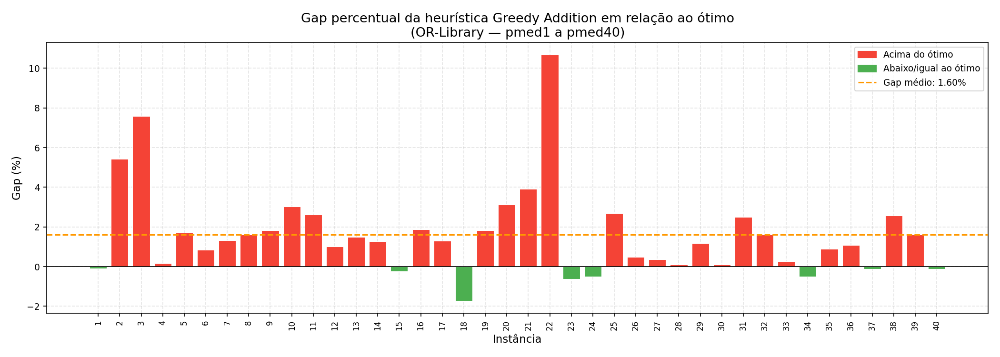
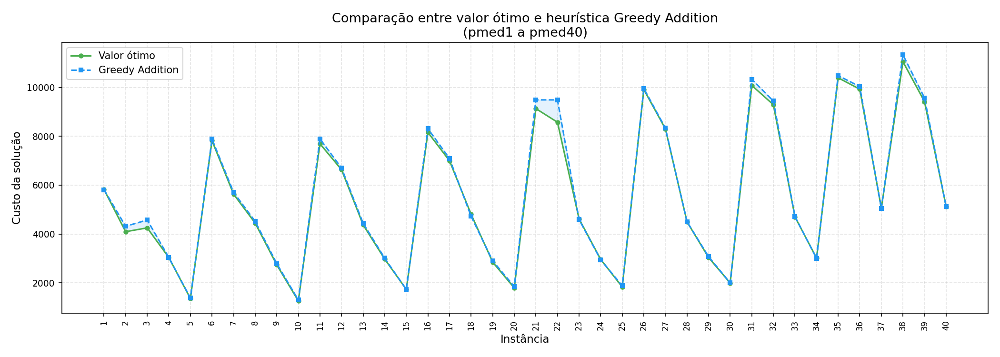
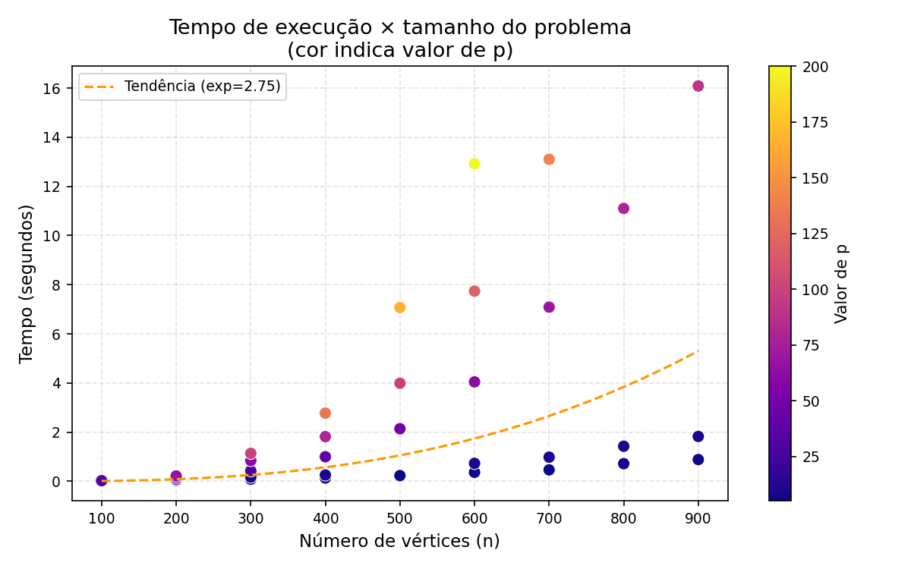

# Heurística Construtiva Greedy Addition para o Problema P-Median

> Disciplina: **SIN-492 — Inteligência Computacional**  
> Universidade Federal de Viçosa — Campus Rio Paranaíba  
> Alunos: Moisés José Moreira Ribeiro e Daniel Imai Yamakawa

---

## Sobre o Problema P-Median

O **Problema P-Median** é um problema clássico de otimização combinatória em logística e pesquisa operacional. Dado um grafo com `n` vértices e um inteiro `p`, o objetivo é escolher exatamente `p` vértices como **facilidades** (medianas) de forma a minimizar a **soma das distâncias** de cada vértice à sua facilidade mais próxima.

Aplicações práticas incluem: localização de hospitais, centros de distribuição, antenas de telecomunicação, entre outros.

---

## Algoritmo Implementado

### Greedy Addition (Myopic)

A heurística construtiva **Greedy Addition** constrói a solução incrementalmente:

1. Começa com um conjunto vazio de facilidades.
2. A cada iteração, avalia todos os vértices candidatos e escolhe aquele que **mais reduz o custo total**.
3. Repete até que `p` facilidades sejam abertas.

**Complexidade:** `O(p × n²)`

O algoritmo usa **Floyd-Warshall** `O(n³)` como pré-processamento para calcular as distâncias mínimas entre todos os pares de vértices, necessário pois os datasets da OR-Library fornecem apenas arestas diretas (grafos esparsos).

**Referência:**  
Resende, M.G.C. and Werneck, R.F. (2004). *A Hybrid Heuristic for the p-Median Problem.* Journal of Heuristics, 10(1), 59–88.

---

## Estrutura do Repositório

```
p-median_problem/
├── dataset/
│   ├── pmed1.txt … pmed40.txt   # Instâncias da OR-Library
│   └── pmedopt.txt              # Valores ótimos de referência
├── graficos/
│   ├── 01_gap_por_instancia.png
│   ├── 02_heuristica_vs_otimo.png
│   └── 04_tempo_vs_n.png
├── p_median_greedy.py           # Algoritmo principal
├── gerar_graficos.py            # Script de visualização dos resultados
├── resultados.txt               # Saída da execução nas 40 instâncias
└── README.md
```

---

## Pré-requisitos

- Python 3.8+
- Bibliotecas padrão: `os`, `time`, `math` (sem dependências externas para o algoritmo principal)
- Para os gráficos: `matplotlib`, `numpy`

```bash
pip install matplotlib numpy
```

---

## Como Executar

### 1. Executar a heurística

```bash
python p_median_greedy.py
```

O script percorre automaticamente todas as instâncias `pmed1.txt` a `pmed40.txt` dentro da pasta `dataset/` e exibe uma tabela comparativa com os valores ótimos.

### 2. Gerar os gráficos

```bash
python gerar_graficos.py
```

Os gráficos serão salvos na pasta `graficos/`.

---

## Formato dos Dados de Entrada

Os arquivos seguem o formato padrão da **OR-Library** (Beasley, 1985):

```
n  m  p
i  j  custo
i  j  custo
...
```

Onde:
- `n` = número de vértices
- `m` = número de arestas
- `p` = número de facilidades a abrir
- Cada linha seguinte representa uma aresta `(i, j)` com o custo associado

**Fonte dos dados:** [OR-Library — J.E. Beasley](http://people.brunel.ac.uk/~mastjjb/jeb/orlib/pmedinfo.html)

---

## Resultados

A heurística foi avaliada nas 40 instâncias da OR-Library (`pmed1` a `pmed40`), com `n` variando de 100 a 900 vértices.

| Métrica | Valor |
|---|---|
| Gap médio | **1,60%** |
| Instâncias com resultado ≤ ótimo | 9 de 40 |
| Pior gap individual | 10,68% (instância 22) |
| Melhor gap individual | −1,73% (instância 18) |

### Gap percentual por instância



### Comparação: Heurística vs. Ótimo



### Tempo de execução vs. tamanho do problema



O tempo de execução cresce com o tamanho `n` e com o valor de `p` (que define o número de iterações da heurística). A tendência empírica observada foi de expoente ≈ 2,75.

---

## Exemplo de Saída

```
===========================================================================
 Inst     n     p      Ótimo   Heurística   Gap (%)  Tempo (s)
===========================================================================
    1    100      5     5819.0       5814.0     -0.09%      0.004s
    2    100     10     4093.0       4315.0      5.42%      0.008s
    3    100     10     4250.0       4572.0      7.58%      0.008s
   ...
   40    900     90     5128.0       5122.0     -0.12%     16.088s
===========================================================================
  Gap médio: 1.60%  (40 instâncias)
===========================================================================
```

---

## Referências

- Resende, M.G.C. and Werneck, R.F. (2004). *A Hybrid Heuristic for the p-Median Problem.* Journal of Heuristics, 10(1), 59–88.
- Beasley, J.E. (1985). *OR-Library: distributing test problems by electronic mail.* Journal of the Operational Research Society, 41(11), 1069–1072. Disponível em: http://people.brunel.ac.uk/~mastjjb/jeb/orlib/pmedinfo.html
